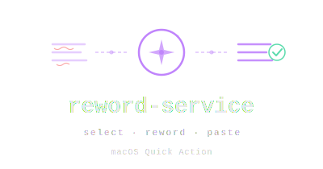
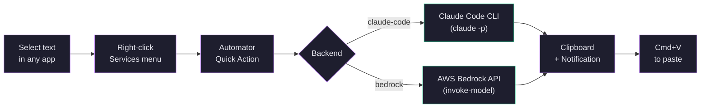

<p align="center">
  
</p>

# Reword and Grammar Check

A macOS right-click service that rewrites and grammar-checks selected text using Claude, while preserving the original tone. Works in any application — select text, right-click, and paste the improved version.

## Architecture

The service hooks into macOS via an **Automator Quick Action** (Services menu), which pipes the selected text into a shell script. The script sends the text to an LLM backend and copies the result to your clipboard.



## Backends

Two backends are supported — pick the one that fits your setup:

### Claude Code (`claude-code`)

Uses [Claude Code](https://docs.anthropic.com/en/docs/claude-code) CLI in **headless pipe mode** (`claude -p`). No app window opens — the CLI runs in the background, sends the text to whichever provider Claude Code is configured with (Anthropic API, Amazon Bedrock, or Google Vertex AI), and returns the result.

**Requirements:** Claude Code installed and authenticated (`claude` available in PATH).

### Amazon Bedrock (`bedrock`)

Calls the [Amazon Bedrock](https://aws.amazon.com/bedrock/) `InvokeModel` API directly via the AWS CLI. This bypasses Claude Code entirely and sends the request straight to Bedrock. Useful if you don't have Claude Code installed or prefer direct API access.

**Requirements:** AWS CLI configured with credentials that have `bedrock:InvokeModel` permission.

Both backends default to **Claude Haiku 4.5** for fast responses (~1-3 seconds), but you can use any Claude model available on your provider.

## Installation

```bash
git clone https://github.com/dgallitelli/macos-reword-service.git
cd macos-reword-service
./install.sh
```

Then create the Automator Quick Action (the install script prints the steps).

### Automator Quick Action setup

1. Open **Automator** → **New Document** → **Quick Action** → **Choose**
2. At the top, set **"Workflow receives current"** → `text`, **"in"** → `any application`
3. From the left panel, drag **Run Shell Script** into the workflow
4. Set **Shell** to `/bin/bash` and **Pass input** to `to stdin`
5. Replace the script contents with:
   ```bash
   export PATH="/usr/local/bin:/usr/bin:/bin:/usr/sbin:/sbin:$HOME/.local/bin"
   /bin/bash "$HOME/.config/reword/reword.sh"
   ```
6. **File → Save** as `Reword and Grammar Check`

> **Tip:** Assign a keyboard shortcut in **System Settings → Keyboard → Keyboard Shortcuts → Services** for even faster access.

## Configuration

Edit `~/.config/reword/config.sh` to customize:

```bash
# Backend: "claude-code" or "bedrock"
REWORD_BACKEND="claude-code"

# Claude Code CLI path (update if yours is elsewhere)
CLAUDE_CLI="$HOME/.local/bin/claude"

# System prompt (customize the rewriting behavior)
REWORD_PROMPT="Reword and grammar-check the following text. Keep the same tone, intent, and meaning. Only return the improved text — no explanations, no quotes, no preamble."

# Bedrock settings (when using bedrock backend)
BEDROCK_MODEL_ID="us.anthropic.claude-haiku-4-5-20251001-v1:0"
BEDROCK_REGION="us-east-1"
```

### Using Claude Code with Bedrock as its provider

If your Claude Code is configured to use Bedrock (rather than the Anthropic API), add these env vars to the config — Automator doesn't inherit your shell environment:

```bash
export CLAUDE_CODE_USE_BEDROCK=1
export ANTHROPIC_MODEL='global.anthropic.claude-haiku-4-5-20251001-v1:0'
```

### Customizing the prompt

The `REWORD_PROMPT` controls exactly what the LLM does. Some ideas:

```bash
# Formal tone
REWORD_PROMPT="Rewrite the following text in a formal, professional tone. Fix any grammar issues. Only return the improved text."

# Simplify
REWORD_PROMPT="Simplify the following text for a general audience. Keep the meaning. Only return the simplified text."

# Translate to English
REWORD_PROMPT="Translate the following text to English. Preserve the tone. Only return the translation."
```

## Troubleshooting

Logs are at `~/.config/reword/reword.log`.

| Issue | Fix |
|-------|-----|
| Service not in right-click menu | System Settings → Keyboard → Keyboard Shortcuts → Services → enable it |
| Script doesn't run | Ensure the Automator workflow was saved as a **Quick Action**, not a regular workflow |
| Auth errors with Claude Code | Run `claude` in terminal first to complete login |
| Claude Code "Not logged in" | Add the required `export` env vars to `config.sh` (see above) |
| Non-ASCII characters mangled | Handled automatically — the script normalizes UTF-8 and Mac Roman encoding |
| Bedrock `AccessDeniedException` | Ensure your AWS credentials have `bedrock:InvokeModel` and the model is enabled in your region |

## License

MIT
